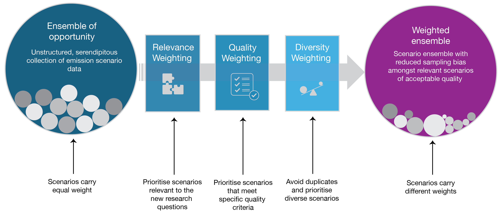

# Emission Scenario Reweighting 

This codebase allows users to reweight emission scenario ensembles based on diversity, relevance or quality. 

* **Diversity reweighting** of scenarios aims to remove redundancy within the ensemble, with greater weights given to scenarios that provide more unique information, considering a specific number of variables. 

* **Relevance weighting** allows the user to apply a binary or continuous weighting to scenarios based on their relevance to a given research question. Here, we provide an example implementation based on scenario temperature outcomes. 

* **Quality weighting** is applied to scenarios based on a set of specific criteria that are important for a given research question. Application of a continuous quality weighting may provide an alternative to simple inclusion/exclusion vetting procedures. 

## Why Reweight Emission Scenario Ensembles?
Presently, users of emission scenario ensembles typically treat each scenario included in the ensemble or subset with equal weight. This is even though some scenarios may be almost identical to others and offer little or no new information. Alternatively, for a range of reasons, some scenarios may not be as relevant as others for a specific question. A different way to display scenario ensemble data is to assign different weights to scenarios based on a set of user-defined goals, and then display the data and calculate summary statistics. So, rather than each scenario being given an even weight, they are given differing weights depending on what the user wants to consider. Although it does not overcome all the problems of looking at summary statistics from scenario ensembles, this reweighting framework aims to move in the direct of viewing a more balanced ensemble. 

## What to consider before getting started?
Approaches to scenario weighting vary depending on the aims of the user. Here, we provide the code that can allow users to reweight using a set of specific methods and criteria; however, reweighting should not be limited to these. This code can provide a basis for future conceptual and methodological development. Before getting started with the weighting approach implemented here, a core set of emission scenario data will be needed. We apply it to the emission scenario ensemble from the IPCC's 6th Assessment Report. However, provided the variables and metadata are available, this code could be used for other scenario ensembles. We provide some functionality to reweight scenario data from the recently launched [Scenario Compass Initiative (SCI)](https://scenariocompass.org/). Full integration and functionality with the SCI database and integration with [Pyam](https://pyam-iamc.readthedocs.io/en/latest/index.html) are coming soon. 

## How to run?
At present, to run the weighting procedure, users can launch the run.py module. Some parameters need updating within the run.py file before getting started. Then, for detailed guidance on how to configure each of the diversity, quality and relevance weightings, refer to the relevant readme files for each module.

